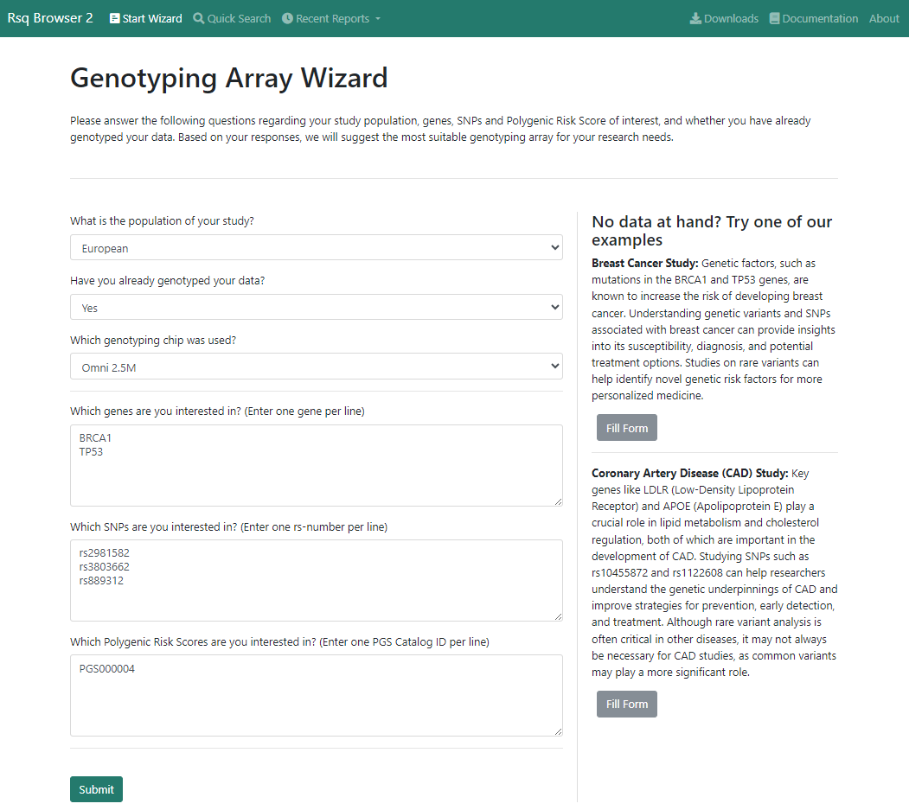

# Getting Started

 
## Minimum Input

To use the wizard (our main functionality) you must select at least two inputs:

- One of the populations of the drop-down list
- already genotyped -> yes/no (drop-down list)
 
 
## Example Scenarios

To give users an overview of the functionality of our tool, we provide two example scenarios.

You can simply click on "Fill Form" below the example description and then on "Submit" to view the results of these example scenarios.

 
## Detailed Description of the Input Mask  

  
  

#### What is the population of your study?

You are required to choose exactly one populations for each submit (direct cross-population evaluation currently not supported).

However, if you are interested in multiple populations simultaneously, we recommend to make separate submits per population.

At present, the following populations are available:

- African
- European
- Finnish
- Hispanic/Latino

  
  
#### Have you already genotyped your data?

If you already genotyped your data you should choose "Yes" to restrict the analysis to the most suitable genotyping array/chip.

Otherwise, we recommend to select "No" to obtain results for all genotyping arrays.

If you choose "Yes" you must select one of the chips in the dropdown menu.

At present, reference data for the following genotyping arrays are available:

- Core (Illumina Infinium Core)
- OmniExpress (Illumina Omni Express)
- Omni 2.5M (Infinium Omni 2.5M)
- MEGA (Multi-Ethnic Genotyping Array)

If your array is not in this list, we recommend to use the array, which is most similar with regard to the number of genotyped variants.

Metadata about the genotyping arrays is provided [here](./data-sources.md).

We aim to extend the reference data to include more genotyping arrays in the future.

#### Which genes are you interested in? (Enter one gene per line)

Here you can optionally add a list of genes of interest. The wizard will then provide imputation quality statistics for each of these genes.

Please enter one gene per line using the official HGNC gene symbol (e.g. LPA for the Lp(a) gene)

#### Which SNPs are you interested in? (Enter one rs-number per line)

Here you can optionally add a list of SNPs of interest. The wizard will then provide imputation quality statistics for each of these SNPs.

Please note that currently only bi-allelic single nucleotide variants are represented in the reference data.

#### Which Polygenic Risk Scores are you interested in? (Enter one PGS Catalog ID per line)

Here you can optionally add a list of PGS IDs of interest. The wizard will then provide imputation quality statistics for each of these PGS. 

Only valid PGS IDs from the PGS Catalog will be accepted.

 
## Valid Example Input

