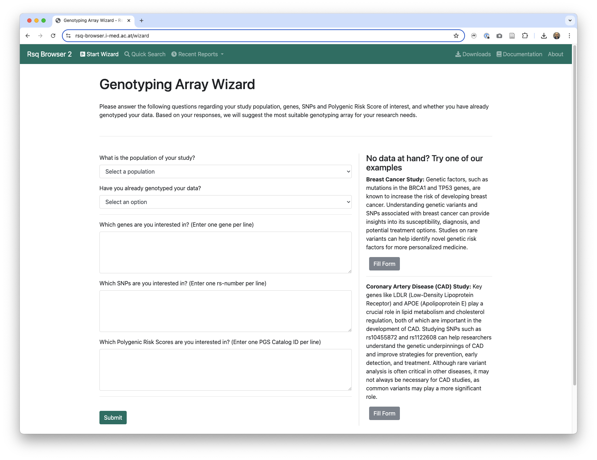

---
hide:
  - navigation
  - toc 
---

# Rsq-Browser 2

Rsq-Browser 2 integrates user-defined inputs such as target genes, SNPs, or PGSs to provide recommendations about the coverage, quality, and cost-effectiveness between different genotyping arrays. By systematically guiding users through a series of questions, Rsq-Browser 2 simplifies the decision-making process by automatically suggesting the optimal combination of reference panels and genotyping arrays based on user inputs. The ranking is conducted using a customized performance score, which is computed from the coverage and quality across the variants of interest and the whole genome. Additionally, the generated report offers detailed insights into the performance of custom genes, SNPs, and PGSs requested by the user. Importantly, the imputation quality is shown stratified by the minor allele frequency of variants, which highlights if rare and ultra-rare variants are well imputed as well. This should further support users in their decision-making process.

