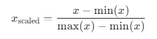
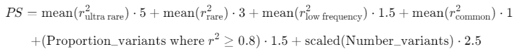
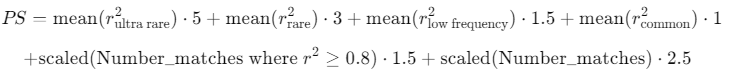

# Calculation of Performance Scores

In general, the performance scores are calculated as a weighted sum of multiple genotype imputation quality metrics.

If a metric is not already in the same range as the [r2 metric](#performance-metric-r2) [0-1], it is scaled to this range with the following formula:

For most evaluations, the variants are stratified in the following 4 MAF bins:

- ultra rare: MAF < 0.5 %
- rare: MAF 0.5-1 %
- low frequency: MAF 1-5 %
- common: MAF > 5 %

Since imputation is more challenging with rare variants and since we want to highlight imputation quality differences between different combinations of genotyping arrays and imputation reference panels, we assign increasingly higher weights to rarer variants:

- weight common = 1
- weight low frequency = 1.5
- weight rare = 3
- weight ultra rare = 5

## Genome-wide

The total genome-wide performance score (PS) is calculated for each combination of genotyping array and reference panel across all variants as follows:

## Genes

The performance score (PS) for each gene is computed for each combination of genotyping array and reference panel across all imputed variants in the respective gene region with the same formula as stated above.

## SNPs

For SNPs, which are individually selected by the user, no performance score is calculated, since the provided r2 metrics directly reflect the imputation quality of the SNPs for each combination of genotyping array and reference panel.

Moreover, the SNPs requested by the user are not weighted according to their MAF, because we assume that they are all equally important for the user.

## Polygenic Risk Scores (PGSs)

The performance score (PS) for each PGS is computed for each combination of genotyping array and reference panel across all PGS variants, which matched with the reference data.

## Total Performance Score for Regions of Interest

The total performance score is the sum of the individual performance scores for genes and PGSs as outlined above plus the r2 value for each custom SNP.

This score is also computed for each combination of genotyping array and imputation reference panel.

## Performance metric r2
r2 refers to the observed imputation r-squared according to the reference data.
It is defined as the squared Pearson correlation coefficient between the imputed genotype dosages and the sequence-based genotypes.

Further details about the r2 metric are described in this [paper](https://doi.org/10.1016/j.ajhg.2022.07.012)
