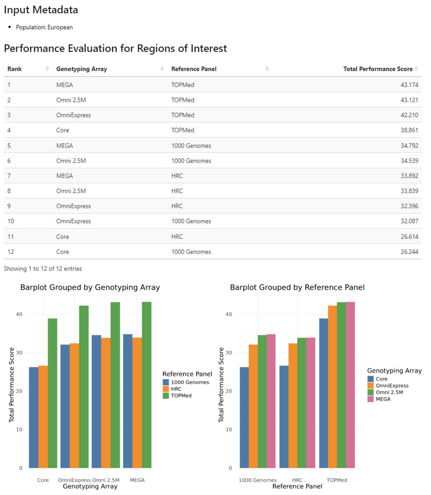
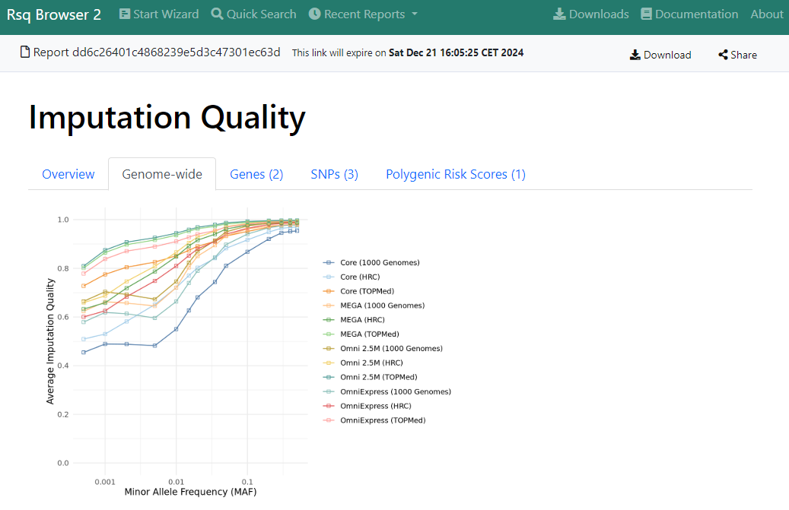
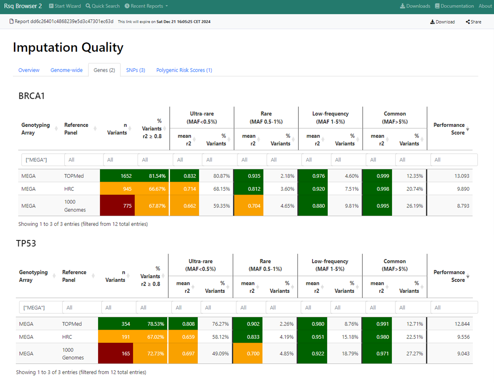
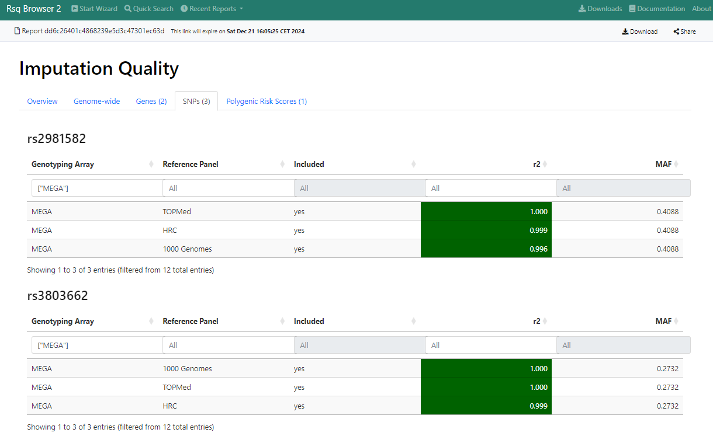
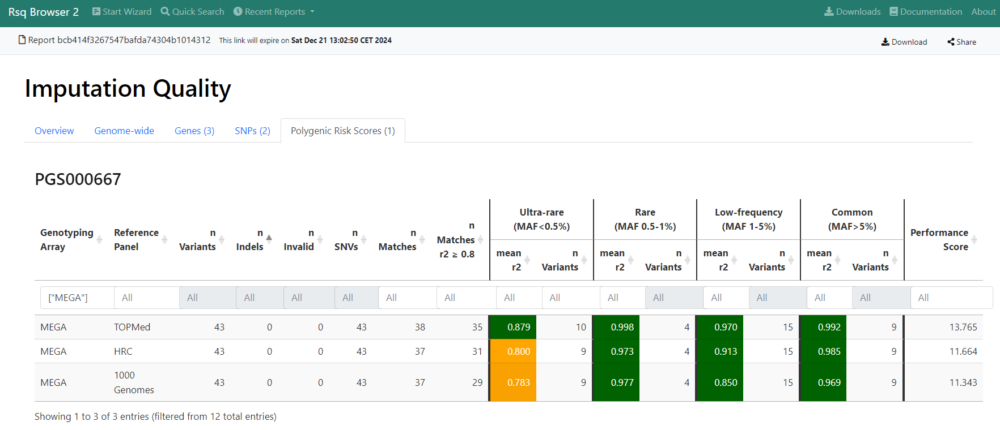

# Report

 
## Overview Dashboard
This tab includes some relevant metadata of the input (e.g. the selected population) and a performance evaluation.

The performance evaluation is performed for each combination of

- Genotyping Array
- and Imputation Reference Panel
available in the reference data.

However if the user selected the option that genotyping was already performed, then only the statistics for the genotyping array selected by the user will be shown.

 
The included genotyping arrays and imputation panels cover a broad range of scenarios:

- MEGA + Omni 2.5 M represent an array with a high number of markers (> 1,7 M)
- OmniExpress represents an array with a medium number of markers (> 700,000)
- Core represents an array with a low number of markers (~ 300,000)

Detailed information about the genotyping arrays, imputation panels, and the reference data is provided in this [paper](https://doi.org/10.1016/j.ajhg.2022.07.012)

A performance evaluation for the specific regions of interest specified by the user will be shown first after the input metadata (if user specified any specific input).

Furthermore, a genome-wide performance evaluation will always be shown.

The calculation of the performance scores is outlined [here](./performance-score.md).

#### **Example:**

## Genome-wide Imputation Quality

This tab contains a figure, which highlights the average imputation quality by minor allele frequency (MAF).

This figure illustrates that the imputation quality tends to decrease with lower MAF values.

#### **Example:**

## Genes

This tab provides detailed performance data for each gene, which was requested by the user if at least one variant of the reference data is present in the gene region.
Gene coordinates are resolved automatically with dbSNP.

For each gene a separate table with summary imputation quality information is shown.

Each table contains the following information:

- Genotyping Array (either all or only the one used for genotyping if user selected the respective option)
- Reference Panel (always all three are shown by default)
- n Variants = number of variants with reference data for the shown combination of genotyping array and reference panel
- % Variants r2 >= 0.8 = percentage of variants with an imputation quality r2 >= 0.8
- for each MAF bin
    - mean r2 = mean of all r2 values of all variants, which fall into this specific MAF bin
    - % Variants = percentage of n Variants, which fall into this specific MAF bin
- Performance Score = imputation quality performance score for each specific combination of genotyping array and reference panel

The calculation of the performance scores is outlined [here](./performance-score.md).

All columns can be filtered interactively.

#### **Example:**

## SNPs

This tab provides detailed performance data for each SNP, which was requested by the user if the SNP is present in the reference data.
SNP coordinates are resolved automatically with dbSNP.

For each SNP a separate table with imputation quality information is shown.

Each table contains the following information:

- Genotyping Array (either all or only the one used for genotyping if user selected the respective option)
- Reference Panel (always all three are shown by default)
- Included = shows if the SNP is available for this specific combination of genotyping array and reference panel
- r2 = r2 metric for this SNP for the shown combination of genotyping array and reference panel
- MAF = minor allele frequency of this SNP according to the reference data

All columns can be filtered interactively.

#### **Example:**

## Polygenic Risk Scores (PGSs)

This tab provides detailed performance data for each PGS, which was requested by the user if (i) the PGS is present in the PGS catalog and (ii) the PGS has at least one variant, which is present in the reference data.
Please note that PGSs, which do not provide both reference and alternative/other allele, are not included since reliable matching with the reference data is not possible for these scores.

For each PGS a separate table with summary imputation quality information is shown.

Each table contains the following information:

- Genotyping Array (either all or only the one used for genotyping if user selected the respective option)
- Reference Panel (always all three are shown by default)
- n Variants = total number of PGS variants
- n Indels = number of PGS variants, which are indels (cannot match with reference data)
- n Invalid = number of invalid PGS variants (e.g. sex chromosomes)
- n SNVs = number of single nucleotide variants in the PGS (only these variants can potentially match to the reference data)
- n Matches = number of PGS SNVs, which have a perfect match (e.g. same position, same alleles) to the corresponding variant in the reference data for the shown combination of genotyping array and reference panel
- n Matches r2 >= 0.8 = number of matches with an imputation quality r2 >= 0.8
- for each MAF bin
    - mean r2 = mean of all r2 values of all matched variants, which fall into this specific MAF bin
    - n Variants = number of matched variants, which fall into this specific MAF bin
- Performance Score = imputation quality performance score for each specific combination of genotyping array and reference panel

The calculation of the performance scores is outlined [here](./performance-score.md).

All columns can be filtered interactively.

#### **Example:**

